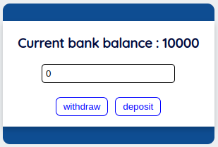

# Getting Started with Create Bank-rate App using React-Typescript.

This project was bootstrapped with [Create React-Typescript App](https://github.com/yagnikvadi2003/bank-rate/).

## Available Scripts

In the project directory, you can run:

### `yarn start`

Runs the app in the development mode.\
Open [http://localhost:3000](http://localhost:3000) to view it in the browser.

The page will reload if you make edits.\
You will also see any lint errors in the console.

### `Output`

[Bank-rate App](https://github.com/yagnikvadi2003/bank-rate/blob/production/public/bank-rate.png)